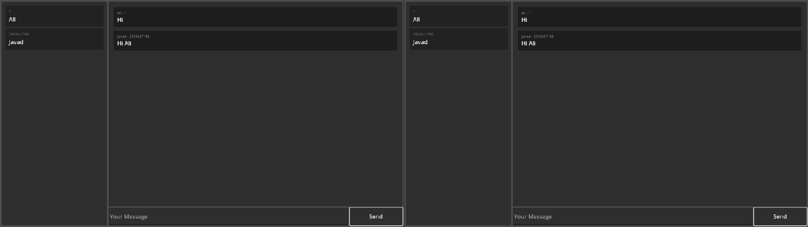

# Synchronizer

A simple GDScript plugin to make networking even easier.

## Justification

This addon has a class called [`Synchronizer`](./addons/synchronizer/synchronizer.gd) which in combine with [`Parameter`](./addons/synchronizer/parameter.gd) class, handles a lot of serialize/deserialization under the hood to send data into network for other connected peers and give a higher level of networking experience to the developers.

Why to use this? Sending objects or inner class objects into the network with just `@rpc` calls is not possible but `Synchronizer` has resolved this issue and can send complex structures of data through the network with ease.

With this plugin, you just change value of a variable which is a `Parameter` object inside a node that inherits the `Synchronizer` class and value of it just updates throughout the network.\
You may ask: "Well... the builtin `MultiplayerSynchronizer` node in godot does the same too" and in response: "Not really..."

When you have to send an object data, `MultiplayerSynchronizer` and `@rpc` calls are not very useful.\
Plus when you need to make a lot of rpc calls, you have to make a lot of rpc functions but with `Synchronizer`, you just create a function and ask it to run on whoever's peer you want and it basically makes you to write less code and worry more about your game logic.

Plus there are extra features that are added in this addon which makes using it very handy.

### Why?

I just wanted to make an online kind of a game show and one thing let into another and I'm here two months later, didn't finish the game but made a whole networking plugin.\
Why would I bother to make a plugin? To write less code and less worry about networking. I wanted to change a variable and it would be updated for everyone else, so I just make a plugin to do that.

### Why it has so less commits?

At the time that I'm writing this document, this project has countable commits. Just wanted to clarify that my commits for this addon went into the game I was making, I just decided to release the addon separate from the game that I was working on.

### It is good?

My experience says yes. try it.

## How To Activate?

1. Copy and paste `synchronizer` folder which is inside `addons` folder. (don't change the `synchronizer` folder name)
2. From editor toolbar, choose **`Project > Project Settings...`** then in **`Plugins`** tab, activate synchronizer plugin.
3. From editor toolbar, choose **`Project > Project Settings > Globals > Autoload`** and inside it, find **`InnerClasses`** script and move it all the way to the top.

## Demo

Simple chat app demo made by this addon.

